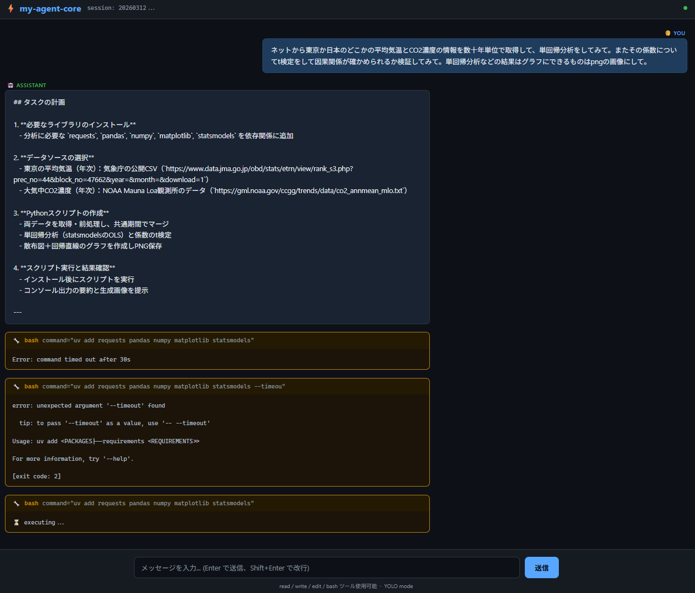

# my-agent-core



[pi-mono](https://github.com/badlogic/pi-mono) のモジュールの一つ pi-agent-core の Python (uv) 超シンプル版。OpenRouter 専用、Docker 隔離で YOLO モード。

## 設計思想

- **4 ツールのみ**: `read` / `write` / `edit` / `bash`
- **システムプロンプト < 1000 トークン**
- **Agentic Context Engineering**: `AGENTS.md` / `USER.md` / `TOOLS.md` / `MEMORY.md` などを自動読み込み
- **1 セッション = 1 コンテナ**（メッセージ履歴を JSON で保存）
- **No MCP / No sub-agents / No permission gates**（Docker 隔離で安全性確保）

## Quick Start

```bash
# 環境変数設定
export OPENROUTER_API_KEY="sk-..."
export MODEL="anthropic/claude-opus-4-5"  # optional

# インストール
uv sync

# ターミナル CLI で起動
uv run agent

# Web UI で起動（http://localhost:8000 をブラウザで開く）
uv run agent-ui
# または
uv run agent --ui
```

## Docker で使う

```bash
# ビルド
docker build -f docker/Dockerfile -t my-agent-core .

# ターミナル CLI モード
docker run -it \
  -e OPENROUTER_API_KEY="sk-..." \
  -v /path/to/your/project:/workspace \
  my-agent-core

# Web UI モード（http://localhost:8000 をブラウザで開く）
docker run -it \
  -e OPENROUTER_API_KEY="sk-..." \
  -e UI_MODE=1 \
  -p 8000:8000 \
  -v /path/to/your/project:/workspace \
  my-agent-core
```

初回起動時に `/workspace/AGENTS.md` テンプレートが自動配置されます。

## セッション管理

- メッセージ履歴: `/workspace/.session/<session_id>/messages.json`
- セッション ID の形式: `YYYYMMDD-HHMMSS-<8桁hex>`（例: `20260312-114537-a3b4c5d8`、UTC）
  - 辞書順ソート = 時刻順ソートになるため、ディレクトリ一覧が時刻順に並びます
- 環境変数 `SESSION_ID` でセッション ID を固定できます（任意の文字列を使用可能）
- 既存セッションは自動復元されます

## Context Engineering

`/workspace/` に以下のファイルを置くと、システムプロンプトに自動注入されます：

| ファイル | 用途 | グローバル対応 |
|---|---|---|
| `AGENTS.md` | エージェントへの指示・プロジェクト情報 | ✓ |
| `USER.md` | ユーザー好み・言語・コーディングスタイル | ✓ |
| `TOOLS.md` | ローカルコマンド・ツール規約 | ✗ |
| `MEMORY.md` | 長期メモリ・プロジェクト知見の蓄積 | ✗ |
| `SYSTEM.md` | システム設定（pi-mono 互換） | ✗ |
| `.agent/instructions.md` | 追加の詳細指示 | ✗ |

`~/.config/my-agent-core/` または `~/.agents/` にグローバルファイル（`AGENTS.md`, `USER.md`）を置くと、全プロジェクト共通の設定として自動読み込みされます。

### オンデマンド・スキル

`.agent/skills/*.md` を配置すると、スキル名+説明だけがシステムプロンプトに列挙されます。
エージェントは必要に応じて `read('.agent/skills/<name>.md')` で詳細を取得します。

## ファイル構成

```
src/my_agent_core/
├── types.py    # Message/Session dataclass
├── tools.py    # read/write/edit/bash 実装
├── llm.py      # OpenRouter SSE streaming client
├── prompt.py   # システムプロンプトビルダー
├── session.py  # JSON セッション保存・復元
├── loop.py     # エージェントループ
└── main.py     # CLI エントリポイント
templates/
├── AGENTS.md   # プロジェクト指示テンプレート
├── USER.md     # ユーザープロファイルテンプレート
├── TOOLS.md    # ツール規約テンプレート
├── MEMORY.md   # 長期メモリテンプレート
└── .agent/
    └── skills/
        └── example.md  # スキルファイルの例
docker/
├── Dockerfile
└── entrypoint.sh
```

## 環境変数

| 変数 | デフォルト | 説明 |
|---|---|---|
| `OPENROUTER_API_KEY` | (必須) | OpenRouter API キー |
| `MODEL` | `anthropic/claude-opus-4-5` | 使用モデル |
| `WORKSPACE_DIR` | カレントディレクトリ | 作業ディレクトリ |
| `SESSION_DIR` | `/workspace/.session` | セッション保存先 |
| `SESSION_ID` | (自動生成) | セッション ID |
